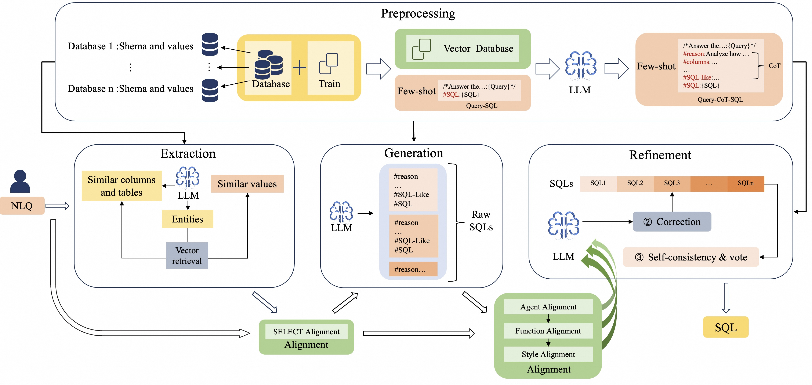
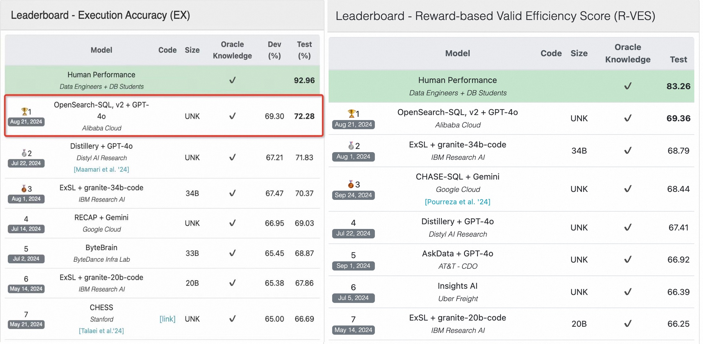

# OpenSearch-SQL
A comprehensive Text-to-SQL framework that achieved first place on [BIRD](https://bird-bench.github.io/) in August 2024. Below is the complete flowchart.
<p align="center">
  
</p>
<div align="center">
  
[📖 Arxiv](https://arxiv.org/abs/2502.14913) |
[中文版](./readme_zh.md) |
EN

</div>

## Text-to-SQL

The goal of the Text-to-SQL task is to eliminate the need for practitioners to have specialized database skills by converting natural language descriptions from users into SQL queries to fulfill their requirements. For example:

**User Query**:
```
"What is the tallest building?"
```
**SQL Query**:
```sql
SELECT building_name FROM buildings ORDER BY height DESC LIMIT 1
```

## Overview
OpenSearch-SQL consists of modules for Preprocessing, Extraction, Generation, Refinement, and Alignment. The entire OpenSearch-SQL framework operates without the need for additional training, and models like GPT, DeepSeek, and Gemini can be used to complete the tasks.

In addition to Schema Linking, Beam Search sampling to generate answers, and Self-Consistency & voting, we have achieved performance improvements through our unique framework design.

1. In OpenSearch-SQL, we introduced for the first time a self-taught CoT (Chain of Thought) augmentation method, which extends the few-shot format from Query-SQL Pair to Query-CoT-SQL Pair. This significantly enhances the model's performance. It is worth mentioning that a few-shot example that is more similar to the query is not necessarily more helpful for model generation. I hope this is useful to you.
2. We designed a structured CoT approach specifically for the Text-to-SQL task and devised a SQL-Like intermediate language to optimize SQL generation.
3. Moreover, we introduced for the first time an Alignment approach to align the input and output of the Agent, which alleviates the issue of model hallucination. This includes:
Different styles required by different datasets
Hallucination in information transfer between Agents
Fundamental logical issues in generating SQL
4. At the time of submission, we achieved first place on three BIRD leaderboards: 69.3% EX on the validation set, 72.28% EX on the test set, and 69.36% R-VES.
<p align="center">
  
</p>


# Run

**Installation**：

```shell
pip install -r requirements.txt
```
**Data processing**：
**Update** For few-shot, we adopted the [DAIL-SQL](https://github.com/BeachWang/DAIL-SQL) method to generate few-shot examples. You can also choose other methods to create few-shot query-SQL pairs. Additionally, you have the option to directly use the [questions](./Bird/fewshot/questions.json) generated by 'src/database_process/generate_question.py' we provide.

And we have recently provided the fewshot source file ['bird_dev.json'](./Bird/bird_dev.json), which we obtained using DAIL-SQL. You can use it to run 'src/database_process/generate_question.py'.

   ```bash
   sh run/run_preprocess.sh  # Output for each directory will be seen in console output, handling fewshot, table, and other data
   ```
You can also use the fewshot data directly from the Bird path.

**Main**：
   ```bash
   sh run/run_main.sh  # ，path：src/runner/database_manager.py-> _set_paths
   ```
   
## 8. Citation
```
@misc{xie2025opensearchsqlenhancingtexttosqldynamic,
      title={OpenSearch-SQL: Enhancing Text-to-SQL with Dynamic Few-shot and Consistency Alignment}, 
      author={Xiangjin Xie and Guangwei Xu and Lingyan Zhao and Ruijie Guo},
      year={2025},
      eprint={2502.14913},
      archivePrefix={arXiv},
      primaryClass={cs.CL},
      url={https://arxiv.org/abs/2502.14913}, 
}
```